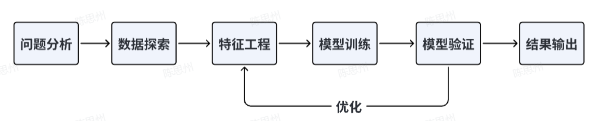
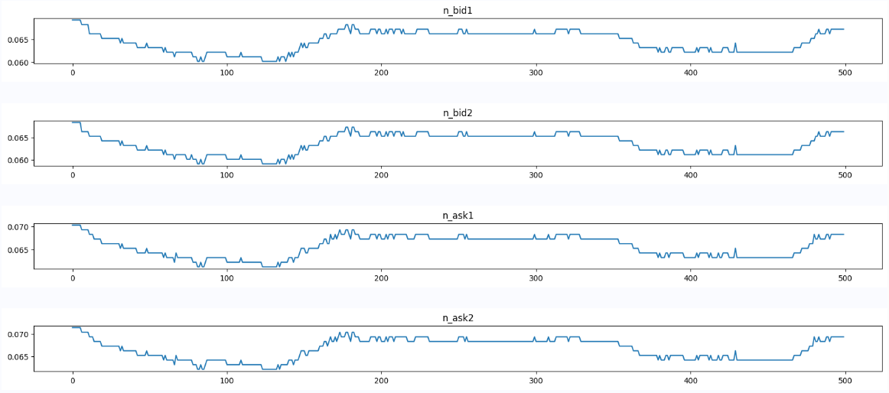
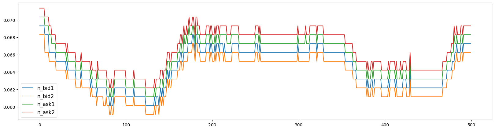
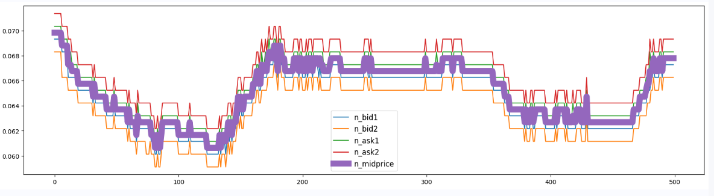
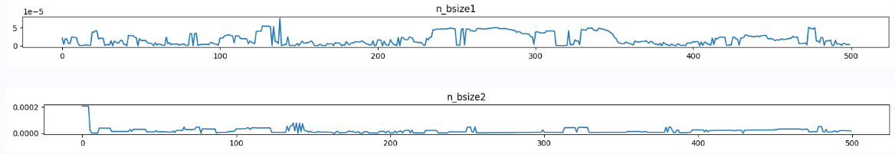
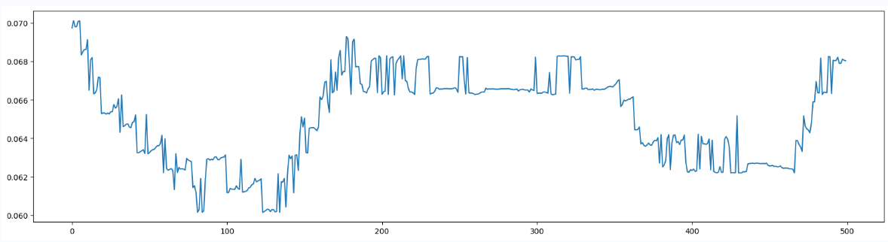
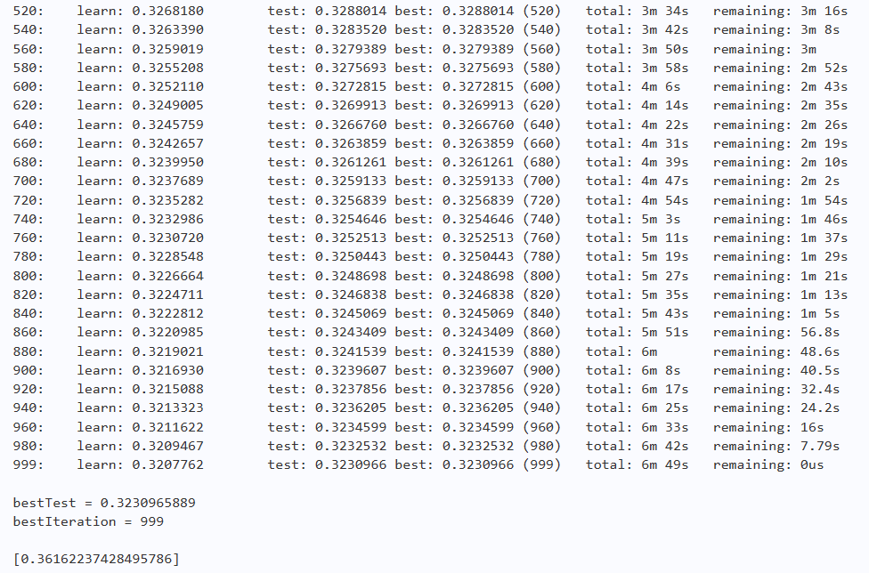

# 机器学习夏令营第一期笔记

>由于是刚刚接触python和机器学习的新手，所以笔记会逐行进行学习并适当借助资料进行学习，顺便还能学习Markdown的使用

## 赛题背景

量化金融在国外已经有数十年的历程，而在国内兴起还不到十年。这是一个极具挑战的领域。量化金融结合了数理统计、金融理论、社会学、心理学等多学科的精华，同时特别注重实践。由于市场博弈参与个体的差异性和群体效应的复杂性，量化金融极具挑战与重大的机遇的特点。 本赛事通过大数据与机器学习的方法和工具，理解市场行为的原理，通过数据分析和模型创建量化策略，采用历史数据，验证量化策略的有效性，并且通过实时数据进行评测。

> 量化策略的定义
> 
> 量化策略是一种基于数学、统计学和计算机算法的交易策略。它使用大量历史市场数据和技术指标来制定投资决策，从而避免或减少主观判断的影响。这些策略通常由计算机程序执行，以执行交易并管理投资组合。

## 赛事任务

***给定数据集***： 给定训练集（含验证集）， 包括10只（不公开）股票、79个交易日的L1snapshot数据（前64个交易日为训练数据，用于训练；后15个交易日为测试数据，不能用于训练）， 数据已进行规范化和隐藏处理，包括5档量/价，中间价，交易量等数据（具体可参考后续数据说明）。

***预测任务***：利用过往及当前数据预测未来中间价的移动方向，在数据上进行模型训练与预测

***输入数据***：

- **行情频率**：3秒一个数据点（也称为1个tick的snapshot）；

- 每个数据点包括当前最新成交价/五档量价/过去3秒内的成交金额等数据；

- 训练集中每个数据点包含5个预测标签的标注； 允许利用过去不超过100tick（包含当前tick）的数据，预测未来N个tick后的中间价移动方向。

- **预测时间跨度**：5、10、20、40、60个tick，5个预测任务；

- 即在t时刻，分别预测t+5tick，t+10tick，t+20tick，t+40tick，t+60tick以后： 最新中间价相较t时刻的中间价：下跌/不变/上涨。

## 赛题数据集

- **行情频率**：3秒一个数据点（也称为1个tick的snapshot）；
- 每个数据点包括当前最新成交价/五档量价/过去3秒内的成交金额等数据；
- 训练集中每个数据点包含5个预测标签的标注；允许利用过去不超过100tick（包含当前tick）的数据，预测未来N个tick后的中间价移动方向。
- **预测时间跨度**：5、10、20、40、60个tick，5个预测任务；即在t时刻，分别预测t+5tick，t+10tick，t+20tick，t+40tick，t+60tick以后：最新中间价相较t时刻的中间价：**下跌/不变/上涨**。

> 当处理金融市场数据时，行情频率是指每个数据点的时间间隔，即每隔3秒钟获取一次市场快照数据，这称为一个tick。每个数据点包含了当前最新的成交价、五档量价（买卖盘的五个价格和对应的买卖量）、过去3秒内的成交金额等信息。我们的目标是通过建立预测模型，利用过去的市场数据和当前的快照数据，在测试集上准确地预测这些未来时刻的中间价涨跌情况，从而实现在金融市场中的投资决策和策略优化。

## 解题思路

本题的任务是构建一种AI量化模型，利用过往及当前数据预测未来中间价的移动方向。 这种AI量化任务是典型的时间序列回归预测问题。处理该问题，一般推荐使用机器学习方法，如CatBoost，LightGBM、XGBoost等树模型，树模型能够比较好地处理数值型数据，可解释性较高。或者使用深度学习方法，但深度模型的搭建上比较复杂，需要自己构建模型结构，对于数值型数据需要进行标准化处理，可解释性弱。

> CatBoost、LightGBM和XGBoost都是常见的梯度提升树模型，它们在机器学习和数据科学领域得到广泛应用，特别是在结构化数据的预测任务中表现优秀。
> ### CatBoost
> - CatBoost是由Yandex开发的梯度提升树模型，专门针对具有分类特征（离散型特征）的数据。它在处理分类特征时具有自动处理的能力，无需手动进行独热编码等预处理步骤。
> - CatBoost采用了对称二叉树结构和排序方法，有效地处理高基数特征（特征值种类多的特征）。此外，CatBoost还实现了一些优化技巧，如基于对称二叉树结构的快速直方图计算，使得模型训练速度更快。
> ### LightGBM
> - LightGBM是微软开源的梯度提升树模型，它在处理大规模数据和高维特征上表现出色。LightGBM采用了基于直方图的决策树算法，通过对特征值的离散化来减少内存消耗，从而能够高效地处理大规模数据。
> - 另外，LightGBM还支持特征并行和数据并行训练，提高了训练速度。它对于处理高基数特征的能力也相对较强。
> ### XGBoost
> - XGBoost是由陈天奇开发的梯度提升树模型，被认为是梯度提升树算法中的一种优化版本。XGBoost在处理结构化数据上有着优异的表现，并且对于特征工程的支持也比较全面。它采用了基于预排序的决策树算法和加权最小二乘（Weighted Quantile Sketch）算法来提高性能和效率。
> - XGBoost还支持特征重要性评估和模型的可解释性分析，这在实际应用中非常有用。
>
>> 梯度提升树（Gradient Boosting Decision Tree，GBDT）是一种集成学习方法，通过组合多棵决策树来进行预测和分类。它是一种增强学习算法，通过不断迭代，每次迭代都试图纠正前一轮迭代的错误，最终得到一个强大的预测模型。有时间进一步了解可以看知乎的一个文章  [GBDT的原理、公式推导、Python实现、可视化和应用](https://zhuanlan.zhihu.com/p/280222403)

解决机器学习的一般思路是：


## Baseline实践

### 导入模块
```python
# 解压数据集，更新所需依赖包
_ = !unzip -qo data/data233139/AI量化模型预测挑战赛公开数据.zip
_ = !pip install --upgrade catboost xgboost lightgbm 
```

```python
import numpy as np # NumPy 是一个用于进行科学计算的Python库，提供了高性能的多维数组对象和数学函数
import pandas as pd # Pandas 是一个数据处理和分析的Python库，它提供了高效的数据结构和数据操作工具，特别适用于处理表格数据。
from catboost import CatBoostClassifier # CatBoost 是一个基于梯度提升树算法的机器学习库，用于分类任务。
from sklearn.model_selection import StratifiedKFold, KFold, GroupKFold # 从 scikit-learn (sklearn) 库中导入了三种交叉验证的类：StratifiedKFold（分层K折交叉验证）、KFold（K折交叉验证）和GroupKFold（分组K折交叉验证）。这些类用于评估模型的性能和帮助避免过拟合。
from sklearn.metrics import accuracy_score, f1_score, roc_auc_score, log_loss, mean_squared_log_error # 从 scikit-learn 库中导入了一些常用的评估指标，用于衡量分类、回归等任务中模型的性能。
import tqdm, sys, os, gc, argparse, warnings #  tqdm（用于在循环中显示进度条）、sys（系统相关的功能）、os（操作系统相关的功能）、gc（垃圾回收功能）、argparse（命令行参数解析功能）和 warnings（警告管理功能）
import matplotlib.pyplot as plt # Matplotlib 是一个用于绘制图表和可视化数据的Python库
warnings.filterwarnings('ignore') # 这行代码设置忽略警告，这样在后续运行代码时，警告信息将不会显示在控制台上
```

### 探索数据

```python
# 读取数据
path = 'AI量化模型预测挑战赛公开数据/'

train_files = os.listdir(path+'train')
train_df = pd.DataFrame()
for filename in tqdm.tqdm(train_files):
    tmp = pd.read_csv(path+'train/'+filename)
    tmp['file'] = filename
    train_df = pd.concat([train_df, tmp], axis=0, ignore_index=True)

test_files = os.listdir(path+'test')
test_df = pd.DataFrame()
for filename in tqdm.tqdm(test_files):
    tmp = pd.read_csv(path+'test/'+filename)
    tmp['file'] = filename
    test_df = pd.concat([test_df, tmp], axis=0, ignore_index=True)
```
> os.listdir() 是 Python 标准库中 os 模块的一个函数，用于列出指定目录（文件夹）中的所有文件和子目录的名称列表。这个函数可以帮助我们获取目录中的文件列表，以便后续对这些文件进行操作，如读取、复制、删除等。
> 
> DataFrame 是 Pandas 库中的一个主要数据结构，它可以看作是一个二维的表格或类似于电子表格的数据结构。DataFrame 是 Pandas 库中最常用的数据结构之一，用于处理和分析结构化的数据，类似于数据库中的表格数据。
>
> 这段代码的意义是将一个目录中的多个CSV文件合并成一个大的DataFrame，并添加一个新的列来标记每条数据来自于哪个文件。
> 
> file1.csv :
> col1 | col2 
> :----------- | ----------:
> A         | 1        
> B         | 2  
>       
> file2.csv :
> col1 | col2 
> :----------- | ----------:
> C         | 3        
> D         | 4
>
> 合并后的DataFrame：
> col1 | col2 | col3
> :----------- | :---------- | ---:
> A         | 1     | file1.csv   
> B         | 2     | file1.csv
> C         | 3     | file2.csv
> D         | 4     | file2.csv
>

首先可以对买价卖价进行可视化分析

选择任意一个股票数据进行可视化分析，观察买价和卖价的关系。下面是对买价和卖价的简单介绍：

- 买价指的是买方愿意为一项股票/资产支付的最高价格。
- 卖价指的是卖方愿意接受的一项股票/资产的最低价格。
- 这两个价格之间的差异被称为点差；点差越小，该品种的流动性越高。

```python
cols = ['n_bid1','n_bid2','n_ask1','n_ask2']
tmp_df = train_df[train_df['file']=='snapshot_sym7_date22_pm.csv'].reset_index(drop=True)[-500:]  # 将文件名为 'snapshot_sym7_date22_pm.csv' 的最后 500 行数据的 DataFrame 存入 tem_df
tmp_df = tmp_df.reset_index(drop=True).reset_index() # 重新设置了索引，并新增了一个包含重新设置的索引值的新列 'index'
for num, col in enumerate(cols):  
    plt.figure(figsize=(20,5))
   
    plt.subplot(4,1,num+1)
    plt.plot(tmp_df['index'],tmp_df[col]) # x轴是索引 1-500，y轴是每一列的对应数值
    plt.title(col)
plt.show()
plt.figure(figsize=(20,5))

for num, col in enumerate(cols):
    plt.plot(tmp_df['index'],tmp_df[col],label=col)
plt.legend(fontsize=12)
```
> enumerate() 是 Python 内置函数，用于同时遍历序列（如列表、元组或字符串）的索引和元素值。它返回的是一个迭代器对象，每次迭代会返回一个包含索引和元素值的元组。
> 
> enumerate(iterable, start=0)
> - iterable: 要遍历的序列，可以是列表、元组、字符串等
> - start: 可选参数，表示索引起始值，默认为 0，也就是从 0 开始

运行之后得到的截图就是 ***snapshot_sym7_date22_pm.csv*** 文件中后五百行买一价，买二价，卖一价，卖二价 的走向




买价与卖价的均值
```python
plt.figure(figsize=(20,5))
for num, col in enumerate(cols):   
    plt.plot(tmp_df['index'],tmp_df[col],label=col)
plt.plot(tmp_df['index'],tmp_df['n_midprice'],label="n_midprice",lw=10)
plt.legend(fontsize=12)
```



我用同样的方法另做了买一量和买二量的可视化



> 波动率是给定股票价格变化的重要统计指标，因此要计算价格变化，我们首先需要在固定间隔进行股票估值。我们将使用已提供的数据的加权平均价格（WAP）进行可视化，WAP的变化反映股票波动情况。
>
> $$ 第一波动率 = \frac{{买一价 \times 买一量 + 卖一价 \times 卖一量}}{{买一量 + 卖一量}}

>
```python
train_df['wap1'] = (train_df['n_bid1']*train_df['n_bsize1'] + train_df['n_ask1']*train_df['n_asize1'])/(train_df['n_bsize1'] + train_df['n_asize1'])
test_df['wap1'] = (test_df['n_bid1']*test_df['n_bsize1'] + test_df['n_ask1']*test_df['n_asize1'])/(test_df['n_bsize1'] + test_df['n_asize1'])

tmp_df = train_df[train_df['file']=='snapshot_sym7_date22_pm.csv'].reset_index(drop=True)[-500:]
tmp_df = tmp_df.reset_index(drop=True).reset_index()
plt.figure(figsize=(20,5))
plt.plot(tmp_df['index'], tmp_df['wap1'])
```



### 特征工程

在特征工程阶段，构建基本的时间特征，提取小时、分钟等相关特征，主要是为了刻画不同时间阶段可能存在的差异性信息。需要注意数据是分多个文件存储的，所以需要进行文件合并，然后在进行后续的工作。

> 机器学习的特征工程是指在构建机器学习模型之前对原始数据进行预处理和特征处理的过程。它是机器学习中非常重要的一步，可以说特征工程直接影响了模型的性能和效果。特征工程的目的是将原始数据转换成适合机器学习模型处理的特征集合，以提高模型的准确性和泛化能力。具体有以下几个步骤：
> - 特征提取（Feature Extraction）：从原始数据中提取出与目标任务相关的有意义的特征。这可能涉及到对原始数据的处理、转换和降维等方法
> - 特征转换（Feature Transformation）：对提取的特征进行转换，使得数据更符合模型的假设和要求。常见的转换包括归一化、标准化等
> - 特征选择（Feature Selection）：选择对目标任务最有用的特征，去除冗余或无关的特征，以降低维度和计算复杂度，同时避免过拟合
> - 特征创造（Feature Creation）：通过组合、交叉或其他方式创造新的特征，以增强模型对数据的表达能力
> - 缺失值处理（Handling Missing Values）：处理原始数据中的缺失值，填充或删除缺失数据，使得数据更完整

```python
# 时间相关特征
train_df['hour'] = train_df['time'].apply(lambda x:int(x.split(':')[0])) 
# 由于time列的格式是 时：分：秒 ，所以用pythonsplit用：分割，第[0]个就是小时，在将其转换为整形存入hour列，后面同理
test_df['hour'] = test_df['time'].apply(lambda x:int(x.split(':')[0]))

train_df['minute'] = train_df['time'].apply(lambda x:int(x.split(':')[1]))
test_df['minute'] = test_df['time'].apply(lambda x:int(x.split(':')[1]))

# 入模特征
# 最后除了uuid、time和file列，都作为训练机器学习的输入特征
cols = [f for f in test_df.columns if f not in ['uuid','time','file']]
```

### 训练模型与验证

```python
def cv_model(clf, train_x, train_y, test_x, clf_name, seed = 2023):
    folds = 5
    kf = KFold(n_splits=folds, shuffle=True, random_state=seed)
    oof = np.zeros([train_x.shape[0], 3])
    test_predict = np.zeros([test_x.shape[0], 3])
    cv_scores = []
    
    for i, (train_index, valid_index) in enumerate(kf.split(train_x, train_y)):
        print('************************************ {} ************************************'.format(str(i+1)))
        trn_x, trn_y, val_x, val_y = train_x.iloc[train_index], train_y[train_index], train_x.iloc[valid_index], train_y[valid_index]
       
        if clf_name == "cat":
            params = {'learning_rate': 0.2, 'depth': 6, 'bootstrap_type':'Bernoulli','random_seed':2023,
                      'od_type': 'Iter', 'od_wait': 100, 'random_seed': 11, 'allow_writing_files': False,
                      'loss_function': 'MultiClass'}
            
            model = clf(iterations=100, **params)
            model.fit(trn_x, trn_y, eval_set=(val_x, val_y),
                      metric_period=20,
                      use_best_model=True, 
                      cat_features=[],
                      verbose=1)
            
            val_pred  = model.predict_proba(val_x)
            test_pred = model.predict_proba(test_x)
        
        oof[valid_index] = val_pred
        test_predict += test_pred / kf.n_splits
        
        F1_score = f1_score(val_y, np.argmax(val_pred, axis=1), average='macro')
        cv_scores.append(F1_score)
        print(cv_scores)
        
    return oof, test_predict
    
for label in ['label_5','label_10','label_20','label_40','label_60']:
    print(f'=================== {label} ===================')
    cat_oof, cat_test = cv_model(CatBoostClassifier, train_df[cols], train_df[label], test_df[cols], 'cat')
    train_df[label] = np.argmax(cat_oof, axis=1)
    test_df[label] = np.argmax(cat_test, axis=1)
```

> - kf = KFold(n_splits=folds, shuffle=True, random_state=seed) 创建了一个 K 折交叉验证的对象 kf，用于拆分训练数据集为训练集和验证集的索引。shuffle=True 表示在拆分前先对数据进行随机打乱，random_state=seed 是设置随机数种子，确保结果可重现。
> - oof = np.zeros([train_x.shape[0], 3]) 创建了一个用于存储交叉验证中每个样本在验证集上的预测结果的数组 oof，3 是由于每个样本有三个类别的标签。
> - test_predict = np.zeros([test_x.shape[0], 3]) 创建了一个用于存储最终测试集上的预测结果的数组 test_predict，3 是由于每个样本有三个类别的标签。
> - test_predict = np.zeros([test_x.shape[0], 3]) 创建了一个用于存储最终测试集上的预测结果的数组 test_predict，3 是由于每个样本有三个类别的标签。
> - cv_scores = []: 创建了一个列表 cv_scores，用于存储每个折的 F1 分数，以便后续计算交叉验证的平均 F1 分数。

我将学习率调低，训练轮次增加到1000，来运行此模型，结果如下图：



### 输出结果

```python
import pandas as pd
import os

# 指定输出文件夹路径
output_dir = './submit'

# 如果文件夹不存在则创建
if not os.path.exists(output_dir):
    os.makedirs(output_dir)

# 首先按照'file'字段对 dataframe 进行分组
grouped = test_df.groupby('file')

# 对于每一个group进行处理
for file_name, group in grouped:
    # 选择你所需要的列
    selected_cols = group[['uuid', 'label_5', 'label_10', 'label_20', 'label_40', 'label_60']]
    
    # 将其保存为csv文件，file_name作为文件名
    selected_cols.to_csv(os.path.join(output_dir, f'{file_name}'), index=False)

_ = !zip -r submit.zip submit/  # 压缩文件
```


